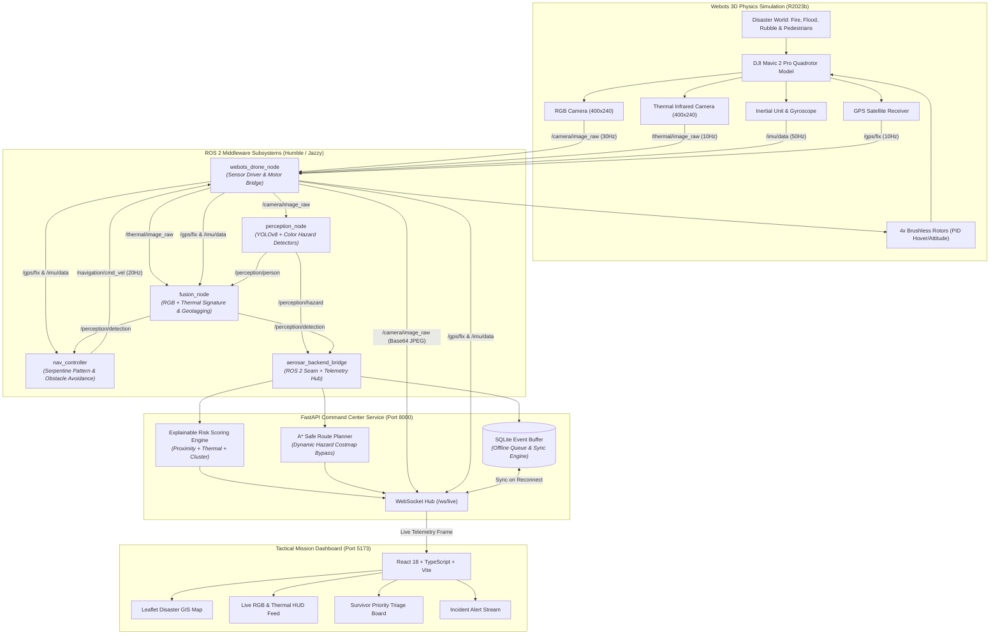

# AEROSAR — Autonomous Emergency Search & Rescue Drone System
### Smart India Hackathon (SIH) 2026 — Problem Statement PS 26177

[](https://docs.ros.org/en/humble/)
[](https://cyberbotics.com/)
[](https://fastapi.tiangolo.com/)
[](https://vitejs.dev/)
[](https://ultralytics.com/)
[](LICENSE)

AEROSAR is a multi-disciplinary autonomous Unmanned Aerial Vehicle (UAV) software stack engineered for emergency disaster search-and-rescue operations. It bridges high-fidelity physics-based drone simulation, multi-sensor AI perception (RGB and thermal infrared fusion), GPS-denied dead-reckoning navigation, explainable victim risk scoring, an offline-resilient event database, and a real-time tactical command center dashboard.

---

## 1. System Architecture & Data Pipeline

AEROSAR establishes a zero-latency, synchronized data loop connecting physics simulation to the command dashboard:



### High-Level Subsystem Breakdown

* **Simulation Layer (`src/aerosar_sim`)**: Custom Webots disaster worlds featuring multi-casualty flood zones, industrial fire outbreaks with smoke, structural collapse rubble, and covered hangars for GPS-denied simulation.
* **Perception Layer (`src/aerosar_perception`)**: Neural object detection via YOLOv8 (`yolov8n.pt`) alongside HSV hazard thresholding to identify active fires, smoke plumes, flood boundaries, and structural debris.
* **Sensor Fusion & Geotagging (`src/aerosar_perception`)**: Fuses 2D bounding boxes with thermal IR temperature arrays to verify signs of life and calculates global WGS-84 geographic coordinates using drone altitude, gimbal orientation, and GPS fix.
* **Autonomous Navigation (`src/aerosar_navigation`)**: Executes serpentine (lawnmower) area-coverage search grids, reactive obstacle avoidance, and automatic dead-reckoning fallback under GPS blackout conditions.
* **Mission Backend & Seam (`backend/` & `src/aerosar_backend_bridge`)**: FastAPI gateway with non-blocking WebSocket streaming, SQLite offline disaster event store, dynamic A* escape path calculation, and explainable multi-factor victim triage scoring.
* **Command Center Dashboard (`frontend/`)**: React + Leaflet operator console providing optical/thermal video with live HUD overlay, survivor priority lists (CRITICAL, HIGH, MEDIUM, LOW), and data-link offline resilience testing.

---

## 2. Prerequisites & System Requirements

| Component | Minimum Specification | Recommended |
| :--- | :--- | :--- |
| **Operating System** | Ubuntu 22.04 LTS (Jammy) / WSL2 | Ubuntu 22.04 LTS native or WSLg |
| **Robotics Middleware**| ROS 2 Humble Hawksbill | ROS 2 Humble |
| **Simulator** | Cyberbotics Webots R2023b | Cyberbotics Webots R2023b |
| **Python** | Python 3.10.x | Python 3.10 or 3.11 with `pip` and `venv` |
| **Node.js & npm** | Node.js v18.0.0+ | Node.js v20.x LTS & npm 10.x |
| **Build Tools** | `colcon`, `cmake`, `build-essential` | `colcon-common-extensions` |
| **Graphics / Display** | OpenGL 3.3 compatible GPU | Intel/NVIDIA GPU or Mesa LLVMpipe |

---

## 3. Step-by-Step Installation Guide (Zero Guesswork)

Follow these steps on a clean Ubuntu 22.04 / WSL2 installation:

### Step 1: Clone the Repository
```bash
git clone https://github.com/amannsaini0507-max/AEROSAR.git aerosar_ws
cd aerosar_ws
```

### Step 2: Install ROS 2 & System Build Tools
If ROS 2 Humble is not already installed on your machine:
```bash
sudo apt update && sudo apt install -y locales
sudo locale-gen en_US en_US.UTF-8
sudo update-locale LC_ALL=en_US.UTF-8 LANG=en_US.UTF-8
export LANG=en_US.UTF-8

sudo apt install -y software-properties-common curl gnupg lsb-release
sudo curl -sSL https://raw.githubusercontent.com/ros/rosdistro/master/ros.key -o /usr/share/keyrings/ros-archive-keyring.gpg
echo "deb [arch=$(dpkg --print-architecture) signed-by=/usr/share/keyrings/ros-archive-keyring.gpg] http://packages.ros.org/ros2/ubuntu $(lsb_release -cs) main" | sudo tee /etc/apt/sources.list.d/ros2.list > /dev/null

sudo apt update && sudo apt install -y \
  ros-humble-ros-base \
  ros-humble-cv-bridge \
  ros-humble-sensor-msgs \
  ros-humble-geometry-msgs \
  ros-humble-webots-ros2-driver \
  python3-colcon-common-extensions \
  python3-pip \
  build-essential \
  lsof
```

### Step 3: Install Cyberbotics Webots Simulator
Download and install Webots R2023b:
```bash
sudo apt update && sudo apt install -y wget
wget -q https://github.com/cyberbotics/webots/releases/download/R2023b/webots_2023b_amd64.deb -O /tmp/webots.deb
sudo apt install -y /tmp/webots.deb
rm /tmp/webots.deb
```

### Step 4: Install Python Backend & Perception Requirements
```bash
pip install --upgrade pip
pip install -r backend/requirements.txt
pip install ultralytics opencv-python numpy
```

### Step 5: Install Frontend Dependencies
```bash
cd frontend
npm install
cd ..
```

### Step 6: Build the ROS 2 Workspace
```bash
source /opt/ros/humble/setup.bash
colcon build --symlink-install
source install/setup.bash
```

---

## 4. One-Command Execution Guide

The unified startup script handles pre-flight audits, environment configuration, software rendering fallbacks, and coordinated parallel launch of Webots, ROS 2, FastAPI, and Vite:

```bash
bash scripts/start_aerosar.sh
```

### Command-Line Execution Options

| Command Flag | Description | Typical Use Case |
| :--- | :--- | :--- |
| `bash scripts/start_aerosar.sh` | **Standard Launch** (Webots GUI + Full ROS 2 Stack + Backend + Frontend) | Primary judge presentation and full-system demo |
| `bash scripts/start_aerosar.sh --headless` | **Headless Mode** (Disables Webots 3D GUI window, keeps camera rendering active) | Headless CI/CD, compute-constrained laptops |
| `bash scripts/start_aerosar.sh --scenario 2` | **Scenario 2** (Fire, Smoke, & Critical Survivor with A* safe evacuation route) | Demonstrating explainable priority triage |
| `bash scripts/start_aerosar.sh --scenario 1` | **Scenario 1** (Flood disaster, flood plane hazard, multiple survivor geotags) | Demonstrating multi-casualty flood operations |
| `bash scripts/start_aerosar.sh --scenario 4` | **Scenario 4** (GPS-denied covered hangar transit with VIO dead-reckoning) | Testing navigation failsafe & sensor drop |
| `bash scripts/start_aerosar.sh --scenario 5` | **Scenario 5** (Network severance with offline SQLite queue & automatic sync) | Requirement 7 offline data resilience evaluation |
| `bash scripts/start_aerosar.sh --rebuild` | **Force Rebuild** (Executes `colcon build --symlink-install` prior to launching) | After editing custom messages or C++/Python nodes |
| `bash scripts/start_aerosar.sh --help` | Show complete command-line options | Quick reference |

---

## 5. Alternative Manual Execution (Layer-by-Layer Debugging)

If you need to isolate or debug individual subsystems across separate terminals:

```bash
# ==========================================
# Terminal 1: ROS 2 + Webots Simulation Stack
# ==========================================
source /opt/ros/humble/setup.bash
source install/setup.bash
export GALLIUM_DRIVER=llvmpipe
export LIBGL_ALWAYS_SOFTWARE=1
export WEBOTS_HOME="/usr/local/webots"
ros2 launch aerosar_bringup aerosar_full_system.launch.py world:=aerosar_disaster_world.wbt enable_gui:=true

# ==========================================
# Terminal 2: FastAPI Command Center Backend
# ==========================================
cd backend
python3 main.py
# (FastAPI listens on http://0.0.0.0:8000, serving /ws/live and /docs)

# ==========================================
# Terminal 3: React Command Center Frontend
# ==========================================
cd frontend
npm run dev:backend -- --host 0.0.0.0 --port 5173
# (Dashboard active on http://localhost:5173)

# ==========================================
# Terminal 4: Real-Time Diagnostic Dashboard
# ==========================================
source /opt/ros/humble/setup.bash
source install/setup.bash
python3 scripts/verify_system_topics.py --duration 3.0
```

---

## 6. System Verification, Endpoints & Diagnostics

### Operational URLs

| Destination | Address | Purpose |
| :--- | :--- | :--- |
| **Tactical Dashboard** | **`http://localhost:5173/`** | Primary operator view: live camera HUD, Leaflet disaster GIS map, survivor priority board, mission status |
| **Simulation Demo Mode** | **`http://localhost:5173/?ws=sim`** | Self-contained in-browser SIH rehearsal scenario |
| **Mission Control** | **`http://localhost:5173/mission-control`** | Start/Abort mission controls, link diagnostic packet counters, manual network drop rehearsal |
| **Mission History & Replay** | **`http://localhost:5173/mission-history`** | Replay slider and audit log of previous search sorties |
| **Briefing View** | **`http://localhost:5173/briefing`** | Clean, high-visibility summary view designed for external monitors or projectors |
| **Backend REST & Swagger Docs** | **`http://localhost:8000/docs`** | Interactive OpenAPI / Swagger interface for querying database events and testing APIs |
| **Telemetry WebSocket Feed** | **`ws://localhost:8000/ws/live`** | High-frequency telemetry and video frame streaming channel |
| **Backend Health Check** | **`http://localhost:8000/health`** | Verifies ROS 2 bridge status and active client count |

### ROS 2 Canonical Topic Interface

| Topic Name | Message Type | Rate (Hz) | Subsystem Function |
| :--- | :--- | :--- | :--- |
| `/camera/image_raw` | `sensor_msgs/msg/Image` | ~20–30 Hz | Optical RGB camera feed from Webots Mavic 2 Pro drone |
| `/thermal/image_raw`| `sensor_msgs/msg/Image` | ~10 Hz | Thermal infrared camera feed from Webots drone |
| `/imu/data` | `sensor_msgs/msg/Imu` | ~50 Hz | Drone 3D attitude (quaternions), angular velocities, linear accelerations |
| `/gps/fix` | `sensor_msgs/msg/NavSatFix` | ~10 Hz | Global WGS-84 coordinates (Latitude, Longitude, Altitude) mapped from Webots |
| `/navigation/cmd_vel`| `geometry_msgs/msg/Twist` | ~20 Hz | 4-DOF velocity vector controlling drone flight trajectory |
| `/perception/person`| `aerosar_msgs/msg/Detection` | Event-driven | AI candidate survivor detections (bounding box, confidence, timestamp) |
| `/perception/hazard`| `aerosar_msgs/msg/Hazard` | Event-driven | Geotagged disaster hazards (fire, smoke, flood, debris, structural collapse) |
| `/perception/detection`| `aerosar_msgs/msg/Detection` | Event-driven | Fused multi-sensor survivor detections with thermal confirmation flag |
| `/mission/status` | `aerosar_msgs/msg/MissionStatus` | ~1 Hz | Battery percentage, search area coverage %, flight state, link connectivity |
| `/alerts/emergency` | `aerosar_msgs/msg/Alert` | Event-driven | High-priority tactical notifications dispatched to the incident commander |

### Workspace Integrity Check
Verify directory layout and message interfaces at any time:
```bash
python3 scripts/system_health_check.py
```

---

## 7. Troubleshooting & Common Pitfalls

### 1. Webots Crashes on WSL2 / Linux (`Segmentation fault (core dumped)`)
* **Cause**: Default Mesa D3D12 GPU hardware acceleration on WSL2 can trigger driver faults with Webots Qt viewports.
* **Fix**: Force the LLVMpipe software rasterizer before executing Webots:
  ```bash
  export GALLIUM_DRIVER=llvmpipe
  export LIBGL_ALWAYS_SOFTWARE=1
  export WEBOTS_HOME="/usr/local/webots"
  ```
  *(This is automatically handled when using `bash scripts/start_aerosar.sh`)*.

### 2. Camera Feed Displays "No RGB/Thermal stream yet"
* **Check 1**: Ensure you are accessing `http://localhost:5173/` (without `?ws=sim`), so the dashboard listens to the live WebSocket server instead of the static mock scenario.
* **Check 2**: Verify that `/camera/image_raw` is actively publishing:
  ```bash
  source /opt/ros/humble/setup.bash
  ros2 topic hz /camera/image_raw
  ```
* **Check 3**: Ensure Webots was launched with rendering enabled (do not pass `--no-rendering` if camera frames are required).

### 3. Port Conflicts (`address already in use` on 8000 or 5173)
* **Cause**: Previous uvicorn or Vite processes did not release their listening socket.
* **Fix**: Clean up all orphaned sockets:
  ```bash
  sudo kill -9 $(lsof -t -i:8000) 2>/dev/null || true
  sudo kill -9 $(lsof -t -i:5173) 2>/dev/null || true
  sudo kill -9 $(lsof -t -i:1234) 2>/dev/null || true
  ```

### 4. `ModuleNotFoundError: No module named 'aerosar_msgs'`
* **Cause**: ROS 2 local workspace overlay was not sourced in your current shell.
* **Fix**:
  ```bash
  source /opt/ros/humble/setup.bash
  source install/setup.bash
  ```

### 5. Webots Drone Controller Fails to Connect
* **Cause**: The drone's extern controller port timed out or defaulted to an unexpected port.
* **Fix**: Set the explicit controller URL in your environment:
  ```bash
  export WEBOTS_CONTROLLER_URL="tcp://127.0.0.1:1234/Mavic 2 PRO"
  ```

---

## 8. SIH 2026 PS 26177 Subsystem Ownership

Project AEROSAR is structured across six integrated engineering domains:

```text
├── Member 1: Drone Simulation & ROS 2 Lead      (Webots worlds, drone URDF, ROS 2 driver bridge)
├── Member 2: AI Perception & Detection Lead     (YOLOv8, thermal fusion, hazard segmentation)
├── Member 3: Autonomous Navigation Lead         (Serpentine search, obstacle avoidance, GPS-denied)
├── Member 4: Backend, Risk & Mapping Lead       (FastAPI, explainable risk scoring, A* safe routes)
├── Member 5: Command Center Dashboard Lead      (React, Leaflet GIS, WebSocket feeds, replay)
└── Member 6: System Integration & Testing Lead  (Hardware seams, test automation, demo scenarios)
```

Developed for the **Smart India Hackathon (SIH) 2026** under Problem Statement **PS 26177**.
